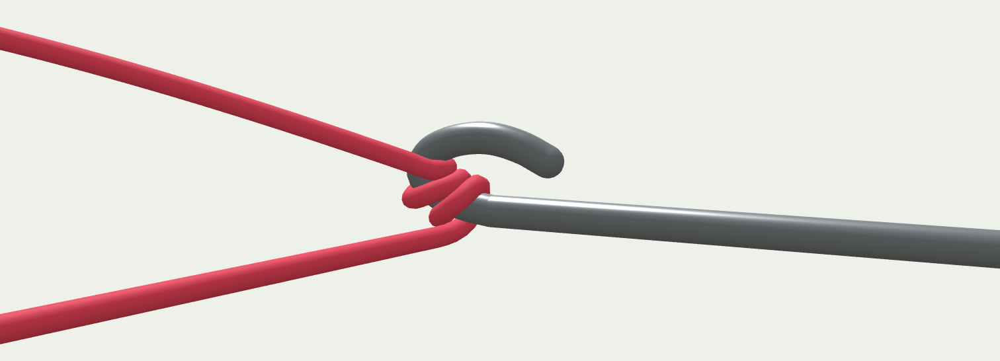

# Crochet Simulator

A web page simulating crochet.

Currently, the system can only simulate simple physical interactions between the crochet hook and the yarn. It is not yet capable of simulating complex crochet techniques.

## How to test

1. Clone this repository to local, or simply download the `index.html` file.
2. Double-click the file to open it.